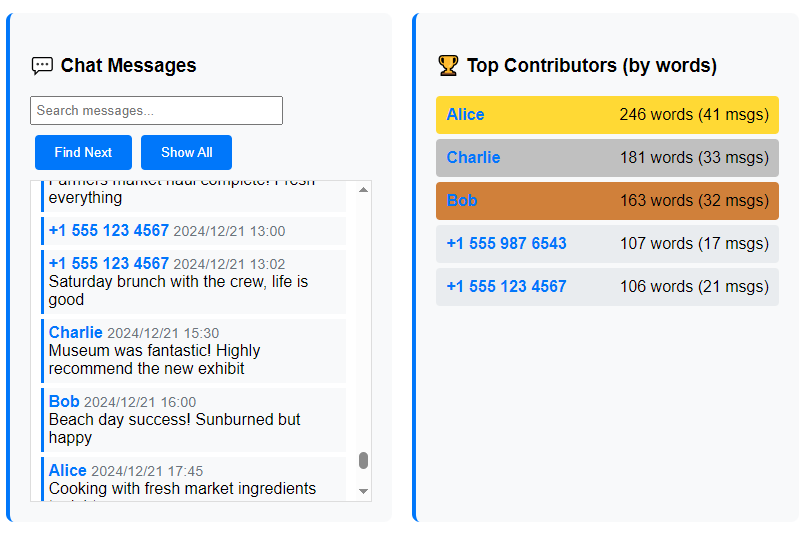
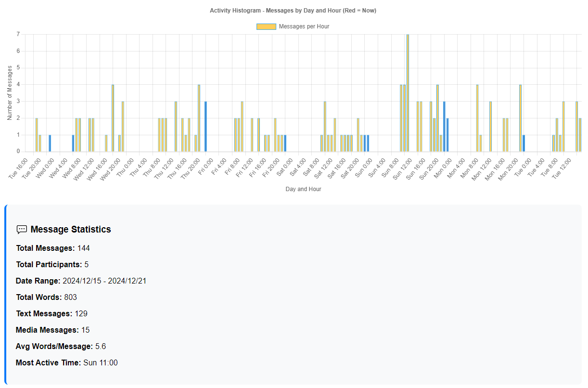

# WhatsApp Chat Analyzer

A web-based tool to analyze WhatsApp group chat exports and generate comprehensive statistics.

*Chat browser with search functionality and top contributors ranking*

*Activity histogram showing daily/hourly patterns and message statistics*

## Features

- **Activity Histogram**: Visual chart showing message activity by day and hour
- **Top Contributors**: Ranking of users by word count with tooltips showing recent messages
- **Unregistered Numbers**: List of phone numbers not saved as contacts
- **Chat Browser**: Searchable message viewer with filtering by sender
- **Statistics**: Overview of messages, participants, date range, and activity patterns

## How to Use

1. Open `index.html` in your web browser
2. Export your WhatsApp chat:
   - WhatsApp → Group → 3 dots → More → Export Chat → Without Media → Gmail
3. Download the .txt file from your email
4. Drag and drop the file or click "Select File" to upload
5. View your chat statistics and analysis

## Data Processing

- Only analyzes messages from the last month
- Dates displayed in YYYY/mm/dd format
- Night hours (10 PM - 6 AM) shown in blue, day hours in yellow
- Activity chart starts from current time and wraps around

## Search Features

- Search messages with real-time highlighting
- "Find Next" to cycle through matches
- Match counter showing current position
- Filter by sender by clicking any username
- "Show All" to clear filters

## Privacy

All processing is done locally in your browser. No data is sent to external servers.